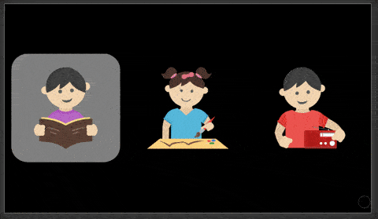

# raspberry-kiosk

> React app and customization scripts to make a Media/eBook device from a RPi
# Live View

<p align="center">
  <a href="https://raspberry-kiosk.netlify.app">
    
  </a>
</p> 

Instructions:
- Use the following keys to navigate:

| KEY | ACTION |
|-----|--------|
| W   | UP     | 
| S   | DOWN   | 
| A   | LEFT   | 
| D   | RIGHT  | 
| O   | BACK   | 
| P   | ENTER  |

Disclaimer: 
- This app was designed to fit on a 840x480 screen. 
- Large files take some time to load, be patient. 

## Deploy on RPi:
 Run the installer on the rpi file, then use your custom keyboard to navigate as detailed on the hardware seccion

## Keyboard maping

This project uses push buttons connected to the RPi GPIO to navigate throug the application.  

### Hardware

|RPI_GPIO | KEY | LINUX_CODE | ACTION |
|---------|-----|------------|--------|
|4        | W   | 17         | UP     | 
|17       | S   | 31         | DOWN   | 
|27       | A   | 30         | LEFT   | 
|22       | D   | 32         | RIGHT  | 
|23       | O   | 24         | BACK   | 
|25       | P   | 25         | ENTER  |

### Software
To map GPIO inputs to keystrokes, you have to modify this file
```
breadboards.dts
```
Then, compile and paste it with this command
```
sudo dtc -I dts -O dtb -o /boot/overlays/breadboard.dtbo breadboard.dts
```
You can find more information following this link
https://blog.geggus.net/2017/01/setting-up-a-gpio-button-keyboard-on-a-raspberry-pi/

## Sources
### Customize boot

You can find instructions here:
https://scribles.net/customizing-boot-up-screen-on-raspberry-pi/

### Start App instead of desktop UI

https://raspberrypi.stackexchange.com/questions/101552/configure-raspberry-pi-to-run-my-application-before-gui-desktop

### Customize chromium
https://www.raspberrypi.org/forums/viewtopic.php?t=205426#:~:text=Full-screen%20mode%3A%20chromium-,out%20of%20full-screen%20mode.
https://peter.sh/experiments/chromium-command-line-switches/

### Clone SD Card and shink to share or even use less space
https://mtyka.github.io/raspberrypi/2019/07/25/shrink-raspberrypi-image.html

https://medium.com/@kitze/%EF%B8%8F-from-react-to-an-electron-app-ready-for-production-a0468ecb1da3

